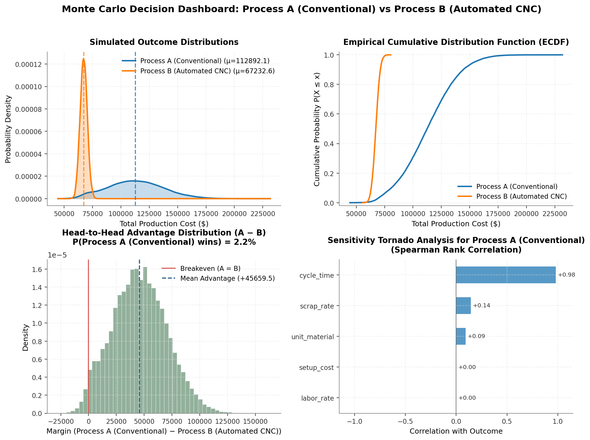

# Monte Carlo Decision Simulator: Evaluating Engineering Trade-Offs Under Uncertainty

[](https://www.python.org/downloads/)
[](tests/)
[](LICENSE)

A decision-analysis toolkit built in Python to evaluate competing engineering and operational strategies under uncertainty. Instead of relying on static point estimates (single "best-guess" values), this simulator models uncertain inputs as probability distributions, executes thousands of vectorized Monte Carlo trials, quantifies tail risk ($\text{VaR}$, $\text{CVaR}$), and conducts sensitivity analysis to identify which assumptions drive the decision.

---

## The Problem: Why Point Estimates Fail

In engineering design, project planning, and systems architecture, decisions are rarely deterministic. When comparing two choices:

* **Strategy A** might have a lower nominal cost on paper, but suffers from high operational variance, scrap rates, or labor delays.
* **Strategy B** might require higher upfront capital investment, but delivers tight repeatability, lower tail risk, and near-zero failure rates.

Evaluating these decisions using single-point averages often conceals catastrophic tail risk—a pitfall known in decision theory as the *Flaw of Averages*. 

This project answers concrete decision questions:
1. **Head-to-head dominance**: What is the true probability that Strategy A outperforms Strategy B ($P(A \succ B)$)?
2. **Tail risk & downside exposure**: What is the 95th percentile worst-case outcome ($\text{VaR}_{95}$) and the expected loss in that worst tail ($\text{CVaR}_{95}$)?
3. **Key driver identification**: Which uncertain variable exerts the greatest influence on outcome variance?

---

## Key Features

- **Vectorized Sampling Engine**: Fast, memory-efficient simulation using NumPy's modern `Generator` API, simulating 50,000 trials across multi-variable strategies in milliseconds.
- **Probabilistic Input Modeling**: Built-in implementations for `Normal`, `Triangular` (three-point PERT estimation), `Uniform`, and `LogNormal` distributions.
- **Decision & Risk Metrics**:
  - Central tendency & dispersion: $\mathbb{E}[X]$, $\sigma$, Median, Interquartile Range (IQR).
  - Downside risk: 95% Value at Risk ($\text{VaR}_{95}$) and Conditional Value at Risk ($\text{CVaR}_{95}$ / Expected Shortfall).
  - Empirical win rates and confidence intervals on payoff margins ($\Delta = A - B$).
- **Sensitivity & Tornado Analysis**: Evaluates Spearman rank correlation ($r_s$) and quantile swing ($10\text{th} \to 90\text{th}$ percentile) to determine which input parameter uncertainties dominate the result.
- **Publication-Style Visualizations**: Clean Matplotlib figures showing probability density (KDE), Empirical Cumulative Distribution Functions (ECDF) for stochastic dominance, delta distribution, and horizontal Tornado charts.
- **Zero Frontend Bloat**: Clean Python library, command-line interface with formatted terminal tables, and a 30-line quickstart demo script.

---

## Case Study: Manufacturing Process Selection

### The Decision Scenario
An engineering team is evaluating two production methods for a structural batch run of 500 components:

| Parameter | Process A (Conventional Machining) | Process B (Automated 5-Axis CNC) |
| :--- | :--- | :--- |
| **Setup & Tooling** | $5,000 (Low fixed cost) | $18,000 (High fixed cost) |
| **Material Cost ($/part)** | $\text{Uniform}(40, 55)$ | $\text{Uniform}(42, 52)$ |
| **Cycle Time (hrs/part)** | $\text{Normal}(\mu=3.2, \sigma=0.6)$ | $\text{Normal}(\mu=1.1, \sigma=0.12)$ |
| **Labor Rate** | $35 / hr | $45 / hr (CNC technician) |
| **Scrap / Defect Rate** | $\text{Triangular}(\text{low}=3\%, \text{mode}=6\%, \text{high}=14\%)$ | $\text{Triangular}(\text{low}=0.5\%, \text{mode}=1.5\%, \text{high}=4\%)$ |
| **Delivery Deadline** | Delay penalty ($40/hr) if labor hours exceed 1,200 hrs | Same schedule constraint |

**Objective**: Minimize Total Cost = $\text{Setup} + \text{Material} + \text{Labor} + \text{Scrap Overhead} + \text{Schedule Penalty}$.

### Simulation Results (25,000 Monte Carlo Iterations)

```text
====================================================================
  DECISION ANALYSIS: Process A (Conventional) vs Process B (Automated CNC)
  Objective: Cost / Loss (Lower is better)
====================================================================
Metric                       | Process A (Conventional) | Process B (Automated CNC)
--------------------------------------------------------------------
Expected Value E[X]          | $112,892.09              | $67,232.56        
Standard Deviation σ         | $24,232.42               | $3,145.92         
Median (50th percentile)     | $112,446.02              | $67,226.25        
IQR (75th - 25th)            | $33,556.28               | $4,246.93         
Min / Max Range              | $44,450.8 .. $231,623.2  | $55,488.5 .. $80,388.2
--------------------------------------------------------------------
5th Percentile               | $72,928.17               | $62,055.01        
95th Percentile (VaR 95%)    | $153,746.85              | $72,427.08        
Conditional VaR (CVaR 95%)   | $164,528.74              | $73,769.40        
--------------------------------------------------------------------
P(Cost <= $85,000 Target)    | 13.3%                    | 100.0%          
====================================================================
  HEAD-TO-HEAD DECISION OUTCOME
  P(Process B outperforms Process A): 97.8%
  P(Process A outperforms Process B): 2.2%
  Expected Cost Advantage of Process B: $45,659.53
====================================================================
```

### Visual Decision Dashboard



### Key Insights from the Analysis
1. **The Nominal Setup Trap**: Process A seems attractive if evaluating only initial capital commitment ($5k vs $18k). However, its expected total cost is **68% higher** ($112.9k vs $67.2k) due to compounding cycle time and labor variability.
2. **Tail Risk Asymmetry**: Process A's 95th percentile worst-case cost reaches **$153,746** (with Conditional VaR $\text{CVaR}_{95}$ of $164,528) due to delivery delay penalties, whereas Process B is tightly bounded with a 95th percentile of **$72,427**.
3. **Sensitivity Driver**: The Tornado analysis reveals that `cycle_time` accounts for a Spearman correlation of **+0.981** and an **$82,904** outcome swing for Process A. Investing in automation (Process B) directly eliminates the primary source of variance.

---

## Project Structure

```
monte-carlo-decision/
├── demo.py                          # 30-line quickstart script
├── requirements.txt                 # Core dependencies (numpy, scipy, matplotlib, pytest)
├── pyproject.toml                   # Project metadata & pytest configuration
├── figures/                         # Generated decision plots
│   ├── manufacturing_dashboard.png
│   └── cloud_dashboard.png
├── monte_carlo/
│   ├── __init__.py                  # Public library API
│   ├── distributions.py             # Vectorized probability distributions
│   ├── model.py                     # UncertainVariable and Strategy abstractions
│   ├── engine.py                    # Vectorized Monte Carlo simulation engine
│   ├── metrics.py                   # Descriptive statistics and risk metrics (VaR, CVaR)
│   ├── sensitivity.py               # Spearman correlation and Tornado analysis
│   ├── plots.py                     # Publication-quality Matplotlib figures
│   ├── scenarios.py                 # Ready-to-run decision scenarios (Manufacturing, Cloud)
│   └── cli.py                       # Command-line interface with formatted reports
└── tests/
    ├── test_distributions.py        # Distribution sampling & statistical tests
    ├── test_engine.py               # Simulation execution & reproducibility tests
    ├── test_metrics.py              # Percentiles, VaR, and CVaR verification
    ├── test_sensitivity.py          # Sensitivity ranking & swing verification
    ├── test_plots.py                # Visual figure generation tests
    ├── test_scenarios.py            # Case study scenarios tests
    └── test_cli.py                  # CLI parameter and execution tests
```

---

## Installation & Setup

Clone the repository and install dependencies:

```bash
git clone https://github.com/adem-temam/monte-carlo-decision.git
cd monte-carlo-decision
pip install -r requirements.txt
```

---

## Usage

### 1. Run the Quickstart Demo (Programmatic API)
The [`demo.py`](demo.py) script shows how to define custom strategies and compare them in ~30 lines:

```bash
python demo.py
```

Code excerpt:
```python
from monte_carlo import MonteCarloSimulator, Normal, Strategy, UncertainVariable

# 1. Define uncertain parameters
cost_a = UncertainVariable("cost", Normal(mean=100.0, std=10.0))
time_a = UncertainVariable("time", Normal(mean=50.0, std=5.0))

cost_b = UncertainVariable("cost", Normal(mean=120.0, std=4.0))
time_b = UncertainVariable("time", Normal(mean=40.0, std=2.0))

# 2. Define strategies with multi-criteria tradeoff: Score = Cost + 1.5 * Time
strat_a = Strategy("Process A", [cost_a, time_a], lambda cost, time: cost + 1.5 * time)
strat_b = Strategy("Process B", [cost_b, time_b], lambda cost, time: cost + 1.5 * time)

# 3. Simulate 10,000 trials
sim = MonteCarloSimulator(n_simulations=10_000, seed=42)
comparison = sim.compare(strat_a, strat_b, higher_is_better=False)

print(f"P(Process A beats Process B): {comparison.win_probability_a * 100:.1f}%")
```

### 2. Command-Line Interface (CLI)

Run the **Manufacturing Process Selection** scenario and save figures:
```bash
python -m monte_carlo.cli --scenario manufacturing --simulations 25000 --save-plots
```

Run the **Cloud vs On-Prem Infrastructure** scenario:
```bash
python -m monte_carlo.cli --scenario cloud --simulations 25000 --save-plots
```

CLI options:
```text
options:
  --scenario {manufacturing,cloud}
                        Predefined scenario to run (default: manufacturing)
  -n, --simulations INT Number of Monte Carlo iterations (default: 25000)
  -s, --seed INT        Random seed for reproducible results (default: 42)
  --save-plots          Save 4-panel dashboard to disk
  --output-dir PATH     Output folder for plots (default: figures)
  --threshold FLOAT     Target threshold to evaluate P(Outcome <= Target)
```

---

## Running Unit Tests

The test suite covers distribution sampling convergence, metric mathematical consistency, paired seed reproducibility, and scenario integrity:

```bash
pytest -v
```

Output:
```text
tests/test_distributions.py::test_normal_distribution PASSED             [  5%]
tests/test_distributions.py::test_uniform_distribution PASSED            [ 10%]
tests/test_distributions.py::test_triangular_distribution PASSED         [ 15%]
tests/test_distributions.py::test_lognormal_distribution PASSED          [ 20%]
tests/test_distributions.py::test_constant_distribution PASSED           [ 25%]
tests/test_distributions.py::test_reproducibility_with_seed PASSED       [ 30%]
tests/test_engine.py::test_strategy_payoff_evaluation PASSED             [ 35%]
tests/test_engine.py::test_simulation_reproducibility PASSED             [ 40%]
tests/test_engine.py::test_head_to_head_comparison_higher_is_better PASSED [ 45%]
tests/test_engine.py::test_head_to_head_comparison_lower_is_better PASSED [ 50%]
tests/test_engine.py::test_shared_variables_coupling PASSED              [ 55%]
tests/test_metrics.py::test_compute_summary PASSED                       [ 60%]
tests/test_metrics.py::test_risk_metrics_maximization PASSED             [ 65%]
tests/test_metrics.py::test_risk_metrics_minimization PASSED             [ 70%]
tests/test_metrics.py::test_format_comparison_summary PASSED             [ 75%]
tests/test_plots.py::test_plots_generation PASSED                        [ 80%]
tests/test_scenarios.py::test_manufacturing_scenario PASSED              [ 85%]
tests/test_scenarios.py::test_cloud_scenario PASSED                      [ 90%]
tests/test_sensitivity.py::test_sensitivity_linear_ranking PASSED        [ 95%]
tests/test_sensitivity.py::test_format_tornado_chart PASSED              [100%]
============================== 20 passed in 0.89s ==============================
```

---

## Technical & Engineering Takeaways

- **Vectorized Array Operations**: Evaluating 25,000 Monte Carlo runs through vectorized NumPy arrays executes in ~15 ms, avoiding slow Python loops and allowing real-time sensitivity sweeps.
- **Common Random Numbers (Variance Reduction)**: When two strategies share environmental or market factors (such as customer demand or ambient temperature), coupling them with identical random seeds reduces the variance of the difference estimator $\text{Var}(\bar{Y}_A - \bar{Y}_B)$.
- **Empirical Cumulative Distribution Functions (ECDF)**: Plotting ECDFs visualizes *stochastic dominance*. If strategy curve $F_B(x)$ is entirely to the left of $F_A(x)$ for a cost objective, Strategy B dominates across all risk preferences.

---

## License

This project is licensed under the MIT License - see the [LICENSE](LICENSE) file for details.
